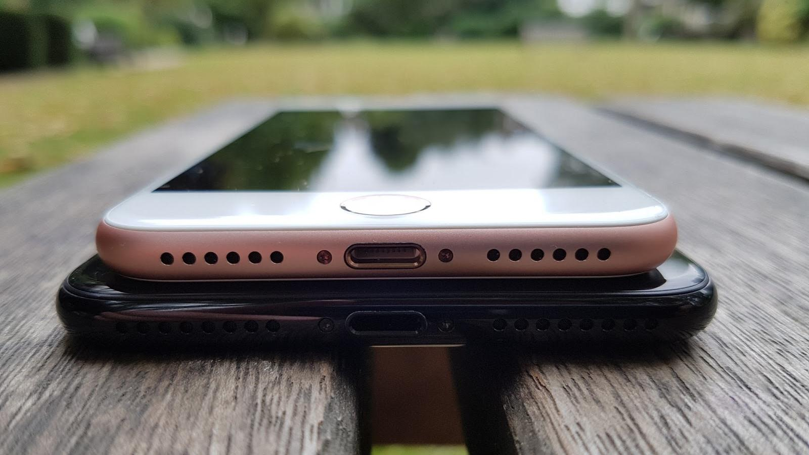
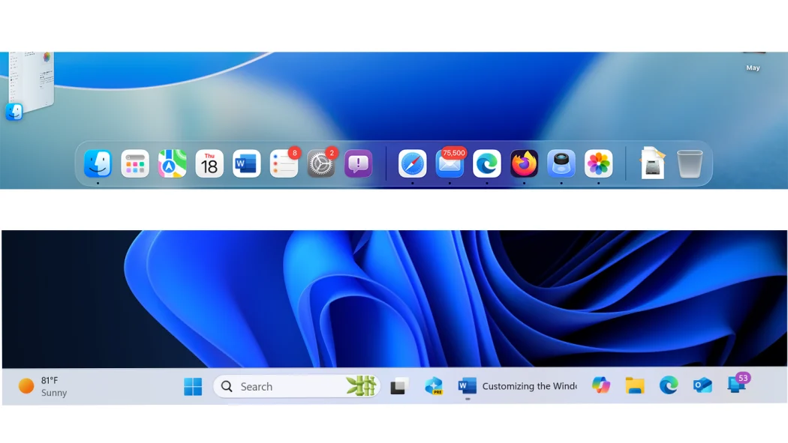
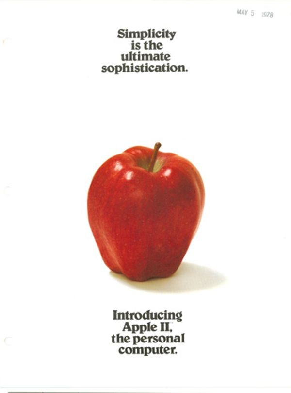
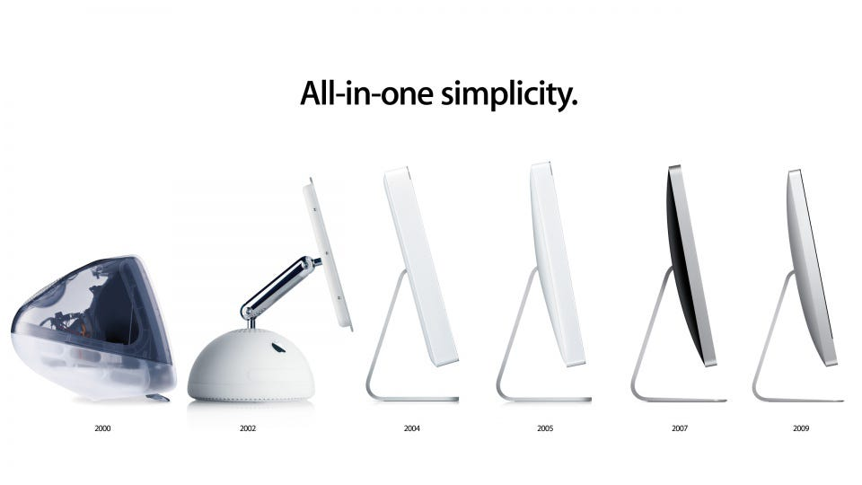
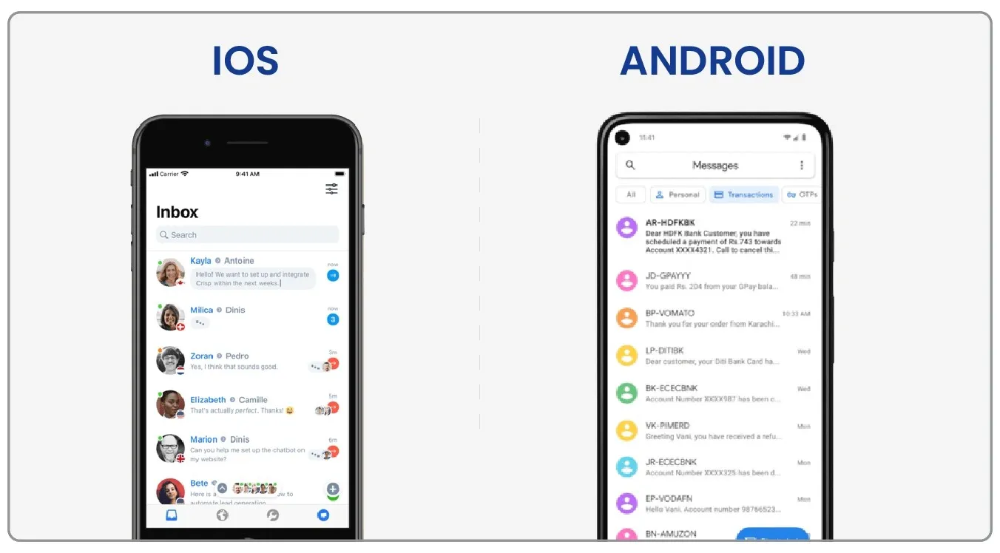

## Abstraction, abstraction, abstraction
There is no way around it or without it in modern life. Practically every living second you are interacting with it, or a by-product, or a result of it. When you are browsing the internet on your laptop or phone, the engineers behind both the hardware and software have made sure that you are only interacting with what is most necessary for you to continue browsing. There are layers on layers on layers of different abstractions to make sure that your experience is as smooth and as straight forward as possible, but it has not always been that way.

Throughout the last decades, we have seen an overarching trend in technology, and that is simplification. Obviously there have been major shifts within tech that have allowed this to happen, for example, the creation of a digital compiler in the early 1950s, moving code compilation from physical hands to digital "assembly" and eventually high-level languages (*[History of compiler construction](https://en.wikipedia.org/wiki/History_of_compiler_construction)*). Such shifts show how abstraction is not strictly limited to the end user (although in this case, the end users are the programmers...) but it takes place all over. And this abstraction is what creates a sort-of "simplification" simultaneously for the user. 

## Specific writing piece inspiration
After reading a blog post from a fellow '26 Amplifier, John Grey - *["Abstraction is Kinda Beautiful"](https://www.johngrey.me/blog/abstraction-is-kinda-beautiful)* (thank you John for the inspiration), I particularly wanted to look at how abstraction and simplification plays an effect on success of a specific product. An example that really stands out to me is Apple. 

## Apple?
I think that Apple does an exceptional job at really maximizing abstraction in order to simplify their products. They do this on both a hardware and software basis, with one of the more memorable revisions being the removal of the headphone jack on the iPhone 7.

Now I am not saying that all of their decisions have been great, but they definitely know what they are doing and set a standard in the industry that others tend to follow. Their decisions are most definitely also supported by the client and user base of their products.

Apple's software design has always been interesting to me. I came from a long-time Windows and Android use history, and was not a big fan of Apple in general (and trust me, I made that clear). But with time, and actually trying out an iPhone, iPad, and most importantly, a Macbook, I understood the hype behind it. 

Apple has nailed abstraction in their software to such a degree where everything feels functional. I am not sure as to how exactly to explain this thought, but in general all of Apple's operating systems are very simple compared to their competitors. While yes, this limits customization and personalization due to the hard-set abstraction set in place, it allows the end users to focus on what's really important like no other, and that is the abstraction and simplification I wanted to bring up.

## How does this relevant in 2026?
I know that this "abstracted philosophy" is not ideal for everyone, in particular a lot of "power-users", but there is a reason as to why Apple has such a grand product prescence, and I do believe a big part of it is this.

As I discussed in *[The disappearance of the IDE](/blog/disappearance-of-the-ide)*, abstraction is more relevant than ever thanks to AI and LLMs. People yearn for simplicity and pure function, and I think that abstraction is the one true way to maximize that.

[John](https://www.johngrey.me) focused a lot on his experience and thoughts on abstraction from a technical standpoint, whereas I braindumped a bit on pushing for simplicity especially with abstraction. Regardless, his blog posts are very worth a read, and I would highly recommend!

For those that want to chat about this post, or any others, feel free to reach out to me by [email](mailto:ivanbardziyan@gmail.com) or on [X](https://x.com/ivanbardziyan).

*Source: ["Why You Don't Need to Design Like Apple" on Medium](https://medium.com/swlh/why-you-dont-need-design-like-apple-a2e6f17064fb).*

*Source: ["Android vs iOS: Differences and Comparisons in App UI Design" on SDLC Corp](https://sdlccorp.com/post/android-vs-ios-differences-and-comparisons-in-app-ui-design/).*
